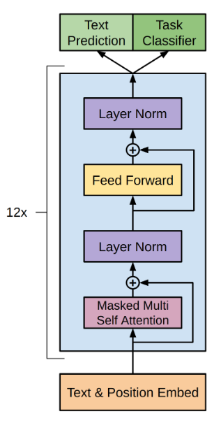

# gpt-tensorflow
Tensorflow implementation of the paper Improving Language Understanding by Generative Pre-Training.

</img>

## Tokenization

The train.py script offers two different tokenization schemes: spacy tokenization, and character-wise tokenization.
Spacy tokenization is the default, and also the one used in the original paper. However, due to the large vocabulary
size it generates, it may be too memory intensive for some machines. In this case, character-wise tokenization can be used.
To switch to character-wise tokenization, set ``use_spacy`` to false in train.py.

## Training in Docker container

```
docker-compose up --build gpt-tensorflow
```

## Citations

```bibtex
@misc{radford_narasimhan_salimans_sutskever, 
    title={Improving Language Understanding by Generative Pre-Training}, 
    author={Alec Radford and Karthik Narasimhan and Tim Salimans and Ilya Sutskever},
    url={https://openai.com/research/language-unsupervised}
} 
```
