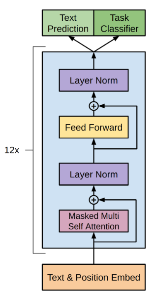

# gpt-tensorflow
Tensorflow implementation of the paper Improving Language Understanding by Generative Pre-Training.

</img>

## Setup Guide

Build docker image:
```
docker build <path_to_this_folder>
```

Run docker container:
```
docker run -it --gpus all <image_id>
```

CD into the project folder:
```
cd gpt-tensorflow
```

Start training:
```
python model.py
```

## Citations

```bibtex
 @misc{radford_narasimhan_salimans_sutskever, 
    title={Improving Language Understanding by Generative Pre-Training}, 
    author={Alec Radford and Karthik Narasimhan and Tim Salimans and Ilya Sutskever},
    url={https://openai.com/research/language-unsupervised}
} 
```
